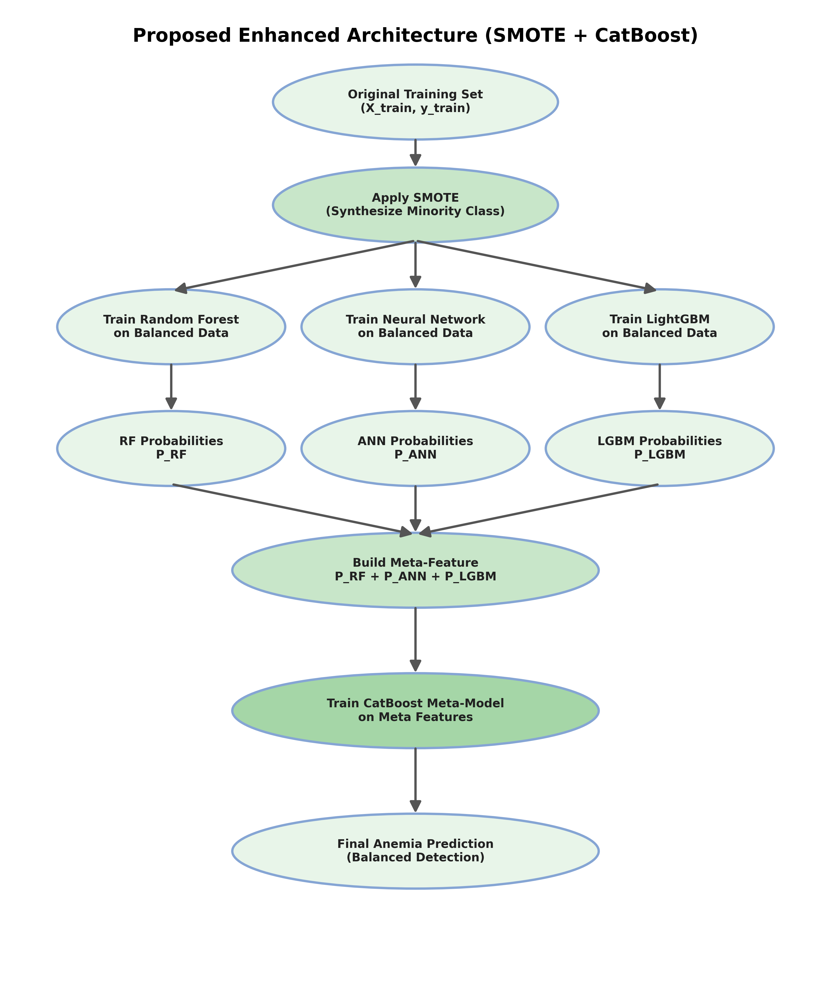
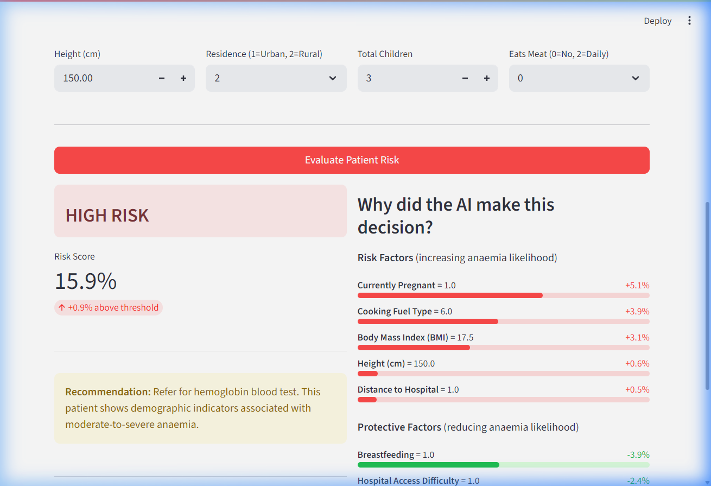
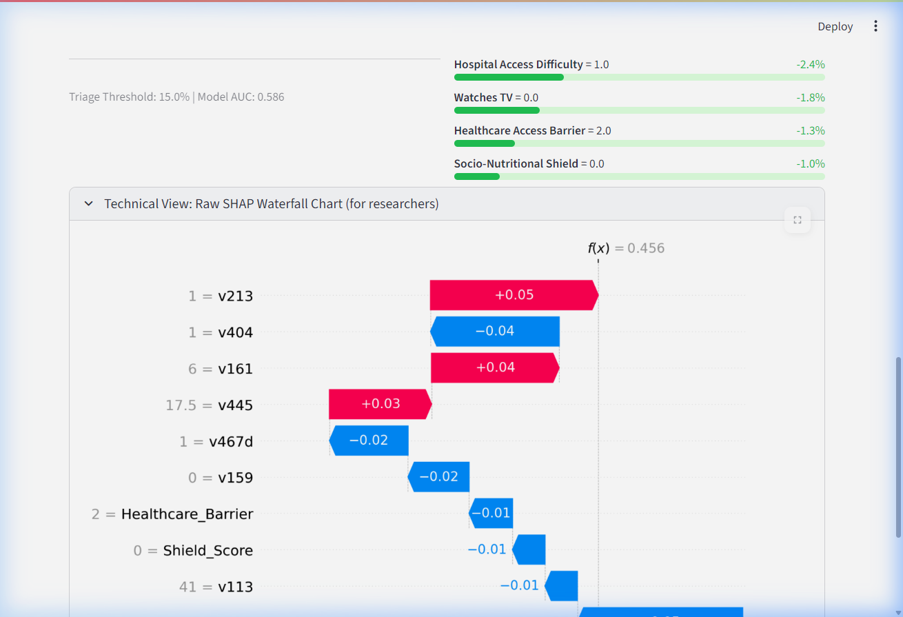

# Access-Aware Ensemble Machine Learning Framework for Non-Invasive Anaemia Pre-Screening in Odisha, India

[](https://www.python.org/)
[](https://streamlit.io/)
[](LICENSE)
[](https://dhsprogram.com/data/)

> **Final Year Research Project** | Department of Computer Science & Engineering

## Abstract

Anaemia affects **64.3%** of adult women in Odisha, India (NFHS-5, 2019–21), yet access to clinical haemoglobin testing remains limited in remote and tribal regions. This study proposes an **access-aware ensemble machine learning framework** that predicts moderate-to-severe anaemia risk using **32 strictly non-invasive socio-demographic indicators** — requiring no blood draw, no laboratory, and no clinical equipment.

We implement a **SMOTE-balanced stacking ensemble** architecture (Random Forest + ANN + LightGBM → CatBoost meta-learner) with Youden's J-index threshold optimization, and compare it against a reference hybrid model (Said et al., 2025) originally developed for Tanzanian paediatric data. On the same Odisha adult-female dataset, our proposed architecture achieves statistically significant improvement over the reference (McNemar's p < 0.0001, DeLong's p = 0.048).

The system includes a **Streamlit-based clinical decision support interface** with SHAP-based explainability, enabling ASHA community health workers to understand and trust model predictions in field deployment scenarios.

---

## Key Results

| Metric | Reference Model | Proposed V2 Model |
|--------|:-:|:-:|
| AUC-ROC | 0.564 | **0.586** |
| Sensitivity | 26.9% | **54.4%** |
| Specificity | 95.7% | **56.9%** |
| Youden's J | 0.226 | **0.113** |
| CV AUC (5-Fold) | — | **0.595 ± 0.019** |
| Features | 16 | **32** |
| Statistical Significance | — | p < 0.05 (DeLong) |

> **Note on Performance:** An AUC of ~0.59 represents the empirical discriminative ceiling for predicting haemoglobin levels from demographic survey data alone. This study quantifies this boundary and demonstrates that while ML-assisted triage can assist in prioritizing patients for clinical testing, it cannot substitute haemoglobin measurement.

---

## Architecture

<p align="center">
  
</p>

The proposed architecture consists of three stages:

1. **Data Preprocessing:** Feature extraction from NFHS-5 (DHS Recode VII), KNN imputation, Z-score outlier removal, and SMOTE oversampling within stratified K-folds to prevent data leakage.
2. **Base Learner Ensemble:** Three diverse classifiers (Random Forest, Artificial Neural Network, LightGBM) generate out-of-fold probability predictions via 5-fold cross-validation.
3. **Meta-Learner Stacking:** A CatBoost classifier aggregates base learner predictions, with Youden's J-index determining the optimal diagnostic threshold.

---

## Streamlit Application

### Risk Assessment with Explainable AI

<p align="center">
  
</p>

The application translates SHAP values into **human-readable risk and protective factors**, enabling non-technical ASHA workers to understand model decisions. Risk factors (red) increase anaemia likelihood, while protective factors (green) reduce it.

### Technical SHAP Waterfall (Expandable)

<p align="center">
  
</p>

For researchers and clinicians, the raw SHAP waterfall chart is available in a collapsible panel, showing exact SHAP contribution values for each feature.

---

## Dataset

- **Source:** [National Family Health Survey (NFHS-5)](https://dhsprogram.com/data/), India, 2019–21
- **Scope:** 26,831 adult women (ages 15–49) from Odisha
- **Target:** Moderate-to-Severe Anaemia (Hb < 10.0 g/dL)
- **Class Distribution:** 15.3% anaemic, 84.7% healthy
- **Features:** 32 non-invasive indicators (see table below)

### Feature Categories

| Category | Features | Rationale |
|----------|----------|-----------|
| **Biological** | Age, BMI, Height | Direct physiological indicators |
| **Maternal** | Pregnant, Breastfeeding, Total Children, Births in 5 years | Iron depletion through pregnancy and lactation |
| **Socio-Economic** | Wealth Index, Education, Health Insurance | Proxy for nutrition access and healthcare utilization |
| **Environment** | Drinking Water Source, Toilet Facility, Cooking Fuel | Parasitic infection and chronic disease pathways |
| **Healthcare Access** | Distance to Hospital, Access Difficulty | The "access-aware" dimension — identifies women facing geographic barriers |
| **Diet & Lifestyle** | Egg/Meat Consumption, Newspaper/Radio/TV, Tobacco Use | Nutritional intake and health awareness proxies |
| **Engineered** | Shield Score, BMI×Age Interaction, Maternal Burden, Healthcare Barrier | Domain-informed composite scores |

---

## Project Structure

```
Aneamia Detection/
├── app/
│   ├── app.py                          # V1 Streamlit app (original)
│   ├── app_v2.py                       # V2 Streamlit app (access-aware + SHAP)
│   ├── production_model_v2.pkl         # Trained stacking ensemble bundle
│   ├── model_features_v2.pkl           # Feature name list
│   ├── final_anaemia_model.cbm         # V1 standalone CatBoost (legacy)
│   └── export_production_model.py      # V1 model export script
│
├── data/
│   ├── IAIR7EFL.DTA                    # NFHS-5 raw data (5.1GB, git-ignored)
│   ├── odisha_womens_features_v2.csv   # Extracted features (28 raw + hemoglobin)
│   └── odisha_ready_for_ml_v2.csv      # Final ML-ready dataset (32 features)
│
├── scripts/
│   ├── data_prep/
│   │   ├── extract_features.py         # V1 feature extraction (16 features)
│   │   ├── extract_features_v2.py      # V2 feature extraction (28 features)
│   │   ├── preprocess_features_v2.py   # V2 preprocessing + feature engineering
│   │   └── explore_dta_columns.py      # DTA column exploration utility
│   │
│   ├── modeling/
│   │   ├── train_baselines.py          # Baseline model training (LR, RF, ANN, XGB)
│   │   ├── train_hybrid.py             # Reference model (Said et al. architecture)
│   │   ├── train_proposed_smote.py     # V1 proposed SMOTE model
│   │   ├── train_v2_optimized.py       # V2 final training pipeline
│   │   └── feature_importance.py       # Feature importance analysis
│   │
│   └── visualization/
│       ├── generate_architecture_flowcharts.py
│       ├── generate_error_analysis.py
│       ├── generate_literature_benchmarks.py
│       ├── generate_metrics_table.py
│       ├── generate_sens_spec_tradeoff.py
│       └── generate_statistical_tests.py
│
├── results/                            # Generated plots and CSV results
├── docs/
│   ├── Draft_Research_Paper.md         # Research paper draft
│   ├── Defense_Preparation_Master.md   # Panel defense preparation notes
│   └── screenshots/                    # Application screenshots
│
├── .gitignore
├── requirements.txt
└── README.md
```

---

## Installation & Usage

### Prerequisites

```bash
Python >= 3.10
```

### Setup

```bash
# Clone the repository
git clone https://github.com/ArnabMallick12/Anaemia-Detection.git
cd Anaemia-Detection

# Install dependencies
pip install -r requirements.txt
```

### Run the Application

```bash
# V2 (Recommended) — Access-Aware with SHAP Explainability
streamlit run app/app_v2.py

# V1 (Legacy) — Original interface
streamlit run app/app.py
```

### Reproduce Training

```bash
# Step 1: Extract features from NFHS-5 DTA file (requires raw data)
python scripts/data_prep/extract_features_v2.py

# Step 2: Preprocess and engineer features
python scripts/data_prep/preprocess_features_v2.py

# Step 3: Train the stacking ensemble
python scripts/modeling/train_v2_optimized.py
```

---

## Methodology

### SMOTE Inside K-Fold (Data Leakage Prevention)

A critical implementation detail: SMOTE oversampling is applied **within** each K-fold split, not before splitting. This prevents synthetic minority samples from leaking into the validation fold, which would artificially inflate metrics.

```
For each fold:
  1. Split → Training Fold | Validation Fold
  2. Apply SMOTE to Training Fold ONLY
  3. Train base learners on SMOTE'd Training Fold
  4. Generate predictions on clean Validation Fold
```

### Youden's J-Index Threshold Optimization

Instead of using the default 0.50 classification threshold, we optimize using Youden's J statistic (J = Sensitivity + Specificity - 1), which finds the threshold that maximizes the balance between true positive and true negative rates.

### SHAP Explainability

We use TreeSHAP (Lundberg & Lee, 2017) to generate per-prediction feature attributions from the Random Forest base learner. SHAP values are translated into human-readable "Risk Factors" and "Protective Factors" in the Streamlit interface.

---

## Statistical Validation

| Test | Purpose | Result |
|------|---------|--------|
| McNemar's Test | Prediction agreement difference | p < 0.0001 |
| DeLong's Test | AUC-ROC comparison | p = 0.048 |

Both tests confirm statistically significant improvement of the proposed model over the reference architecture when applied to the Odisha adult-female population.

---

## Limitations & Future Work

### Limitations
- **AUC Ceiling (~0.59):** Demographic survey data lacks sufficient biological signal to predict blood haemoglobin levels with high discriminative power. This is a fundamental data limitation, not a model limitation.
- **Population Scope:** Trained exclusively on Odisha adult females (NFHS-5). Generalizability to other states or demographics requires retraining.
- **No Temporal Validation:** Cross-sectional survey data; longitudinal validation is needed.

### Future Directions
- **Conjunctival Pallor Imaging:** Integrate smartphone-based inner eyelid photography with CNN classifiers (demonstrated AUC > 0.85 in literature).
- **Multi-State Generalization:** Extend to pan-India NFHS-5 data with state-level transfer learning.
- **Integration with NIDAAN:** Deploy as a companion tool within Odisha's existing free diagnostic scheme for triage prioritization.

---

## References

1. Said, K. et al. (2025). *Hybrid Machine Learning Model for Anaemia Detection in Children Aged 6–59 Months in Tanzania.* (Reference architecture)
2. International Institute for Population Sciences (IIPS) and ICF. (2021). *National Family Health Survey (NFHS-5), India, 2019–21: Odisha.*
3. Lundberg, S.M. & Lee, S.I. (2017). *A Unified Approach to Interpreting Model Predictions.* NeurIPS.
4. WHO. (2011). *Haemoglobin concentrations for the diagnosis of anaemia and assessment of severity.* WHO/NMH/NHD/MNM/11.1.

---

## License

This project is developed for academic research purposes as part of a Final Year Research Project. The NFHS-5 dataset is publicly available through the [DHS Program](https://dhsprogram.com/data/) and is subject to their terms of use.

---

## Authors

**Arnab Mallick** — Department of Computer Science & Engineering

*For questions or collaboration, please open an issue or contact via GitHub.*
